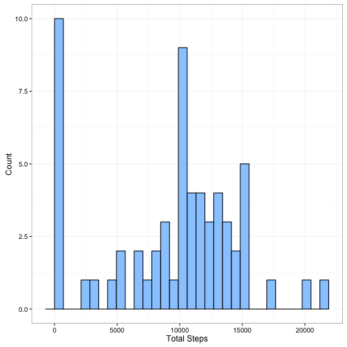
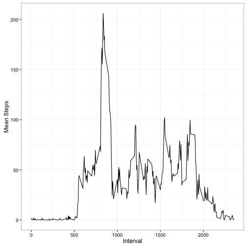
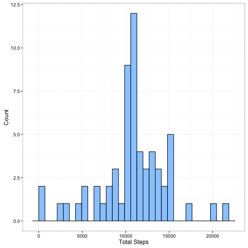
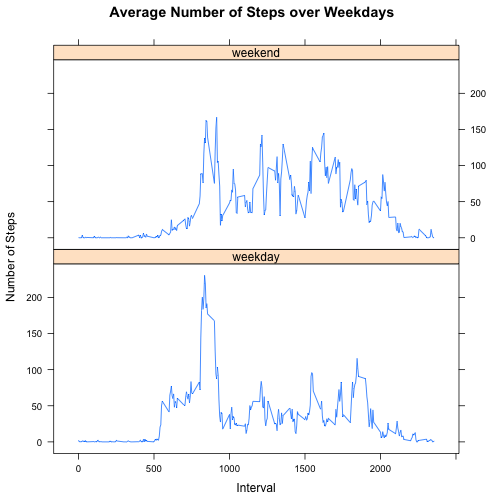

This assignment makes use of data from a personal activity monitoring
device. This device collects data at 5 minute intervals through out the
day. The data consists of two months of data from an anonymous
individual collected during the months of October and November, 2012
and include the number of steps taken in 5 minute intervals each day.

## Loading and preprocessing the dataun

The variables included in this dataset are:

* **steps**: Number of steps taking in a 5-minute interval (missing
    values are coded as `NA`)

* **date**: The date on which the measurement was taken in YYYY-MM-DD
    format

* **interval**: Identifier for the 5-minute interval in which
    measurement was taken

The dataset is stored in a comma-separated-value (CSV) file and there
are a total of 17,568 observations in this
dataset.

We directly load the data from the zip file under the same directory as our document/script.


```r
require(dplyr)
require(ggplot2)
require(lattice)
require(data.table)

activity <- read.csv(unz("activity.zip", "activity.csv"))
activity <- data.table(activity)
activity <- activity %>% mutate(date=as.Date(date, "%Y-%m-%d"))
```

## What is mean total number of steps taken per day?

To calculate the mean number of steps per day, we group the day by the date field.


```r
dailyMetrics <- activity %>% 
    group_by(date) %>% 
    summarise(totalSteps=sum(steps, na.rm = T))

ggplot(dailyMetrics, aes(x=totalSteps)) +
    xlab("Total Steps") + ylab("Count") +
    geom_histogram(colour="black", fill="#99CCFF") +
    theme_bw()
```

 

```r
r <- dailyMetrics %>% summarise(meanSteps=mean(totalSteps, na.rm = TRUE), medianSteps=median(totalSteps, na.rm = TRUE))
```

The average number of steps taken per day was 9354.2295082, and the median was 10395.

## What is the average daily activity pattern?

Similar to what we did we before, but now we group the data by time intervals.


```r
intervalMetrics <- activity %>% 
    group_by(interval) %>% 
    summarise(meanSteps=mean(steps, na.rm = T))

ggplot(intervalMetrics, aes(interval, meanSteps)) + geom_line() +
    xlab("Interval") + ylab("Mean Steps") +
    theme_bw()
```

 

```r
maxInterval <- intervalMetrics[meanSteps==max(meanSteps),]
```

The interval period with the highest mean number of steps was 835, with an mean of 206.1698113 steps.

## Imputing missing values

To fill in the missing values, we're going to use the the mean number of steps for each interval.


```r
missingValuesCount = nrow(activity[is.na(steps),])

replaceNAs <- function(){
    values <- sapply(1:nrow(activity), function(index){
        if (is.na(activity[index, steps])){
            return (intervalMetrics[interval==activity[index, interval], meanSteps])
            }else{
                return(activity[index, steps])
                }
        })    
    }

newActivity <- activity %>% mutate(steps=replaceNAs())

newDailyMetrics <- newActivity %>% 
    group_by(date) %>% 
    summarise(totalSteps=sum(steps, na.rm = T))

ggplot(newDailyMetrics, aes(x=totalSteps)) +
    xlab("Total Steps") + ylab("Count") +
    geom_histogram(colour="black", fill="#99CCFF") +
    theme_bw()
```

 

```r
newR <- newDailyMetrics %>% summarise(meanSteps=mean(totalSteps, na.rm = TRUE), medianSteps=median(totalSteps, na.rm = TRUE))
```

There are a total of 2304 NAs in the data set. 

By imputing the values, the distribution of the data changes. The average number of steps taken per day changes to 10766.19, and the median to 10766.19.
Now, the most frequent average number of steps taken are around 10000 and 11000. The number of days without any activity reduced from 10 to just about 2.

## Are there differences in activity patterns between weekdays and weekends?

A visual comparison of the distributions of the number of steps relative to the interval, grouped by weekday and weekend dates might help us determine if there is a difference between them.


```r
computeWeekday <- function(){
    weekdays <- sapply(newActivity$date, function(date){
    
    if (weekdays(date) %in% c("Saturday", "Sunday")){
    return("weekend")
    }else{
        return("weekday")
        }
    })
    
    as.factor(weekdays)
}

newActivity <- newActivity %>% mutate(weekday=computeWeekday())

newIntervalMetrics <- newActivity %>% 
    group_by(interval, weekday) %>% 
    summarise(meanSteps=mean(steps, na.rm = T))

xyplot(meanSteps~interval|weekday, 
       data=newIntervalMetrics,
       main="Average Number of Steps over Weekdays", 
       ylab="Number of Steps", xlab="Interval", type="l",
       layout=c(1,2))
```

 

Analyzing the patterns of steps during weekdays and weekends it seems that, on average, more steps are taken at each interval during the weekend, although the highest number of steps across all intervals is on weekdays.
